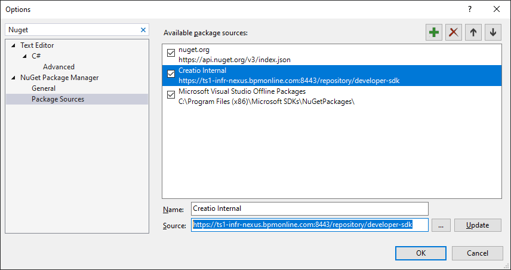
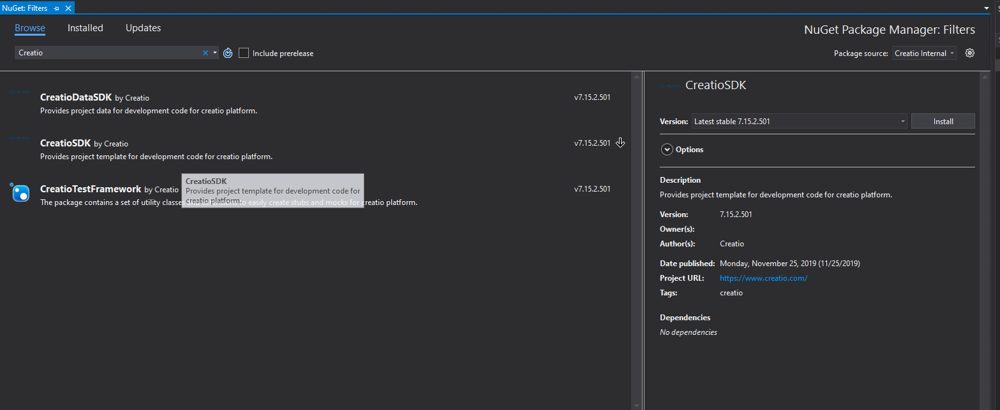

To add Creatio repository in Visual Studio Navigate to:
 
**Tools --> Options --> NuGet Package Manager --> Package Sources**

Click on **+** to add you source

Name: Creatio 
Source: **https://ts1-infr-nexus.bpmonline.com:8443/repository/developer-sdk** 

You can now add CreatioSDK to your package
