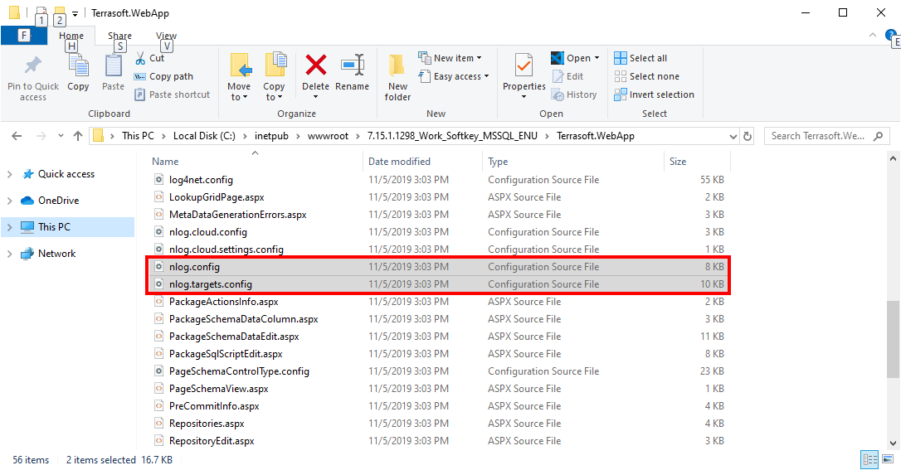

To enable custom logging update **nlog.config** and **nlog.targets.config**. Both files are located in [AppPath]\Terrasoft.WebApp <br/><br/>


Add the following to **nlog.config** file:
```xml
<logger name="GuidedLearningLogger" writeTo="GuidedLearningAppender" 
        minlevel="Info" final="true" />
```

Add the following to the **nlog.target.config** file
```xml
<target name="GuidedLearningAppender" xsi:type="File"
	layout="${Date} [${ThreadIdOrName}] ${uppercase:${level}} ${UserName} ${MethodName} - ${Message}"
	fileName="${LogDir}/${LogDay}/GuidedLearning.log" />
```

# Academy Related Articles
- [Logging](https://academy.creatio.com/documents/technic-sdk/7-15/logging-creatio-nlog)


