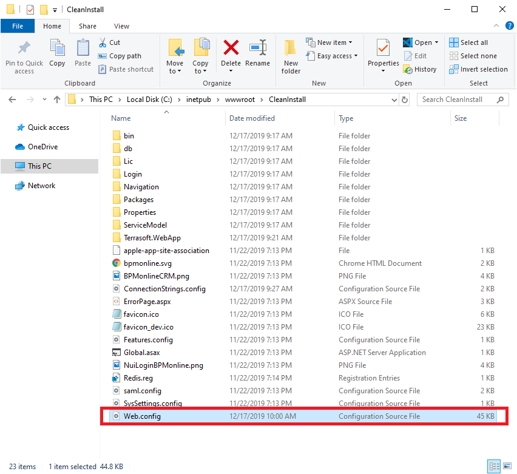
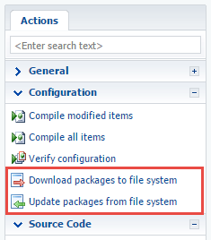
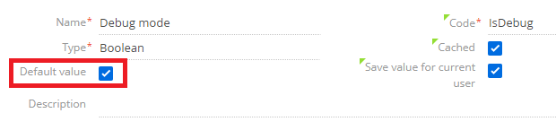

# Step 1
To enable development in the file system, edit Web.config file (located in the root folder of the installed application) and set the attributes as following<br /><br />**Update [AppPath]\web.config** 

```xml
<fileDesignMode enabled="true"/>
<add key="UseStaticFileContent" value="false" />
```



# Step 2
- Navigate to `http(s)://[your_instance]/0/dev` and click on _**Download packages to file system**_<br/>


- Browse to
`
C:\inetpub\wwwroot\[Your_Install_Folder]\Terrasoft.WebApp\Terrasoft.Configuration\Autogenerated\Src
` to find downloaded content


# Step 3
Enable Debugging mode for client side source code. Change SystemSetting Debug mode (code: IsDebug) to true <br />
<br/>
Once configured, you will see additional optopions under profile <br />


# Academy Related Articles
- [Enable File System Mode](https://academy.creatio.com/documents/technic-sdk/7-15/introduction-9)
- [IsDebug](https://academy.creatio.com/documents/technic-sdk/7-15/isdebug-mode) - Used to get additional debugging info.